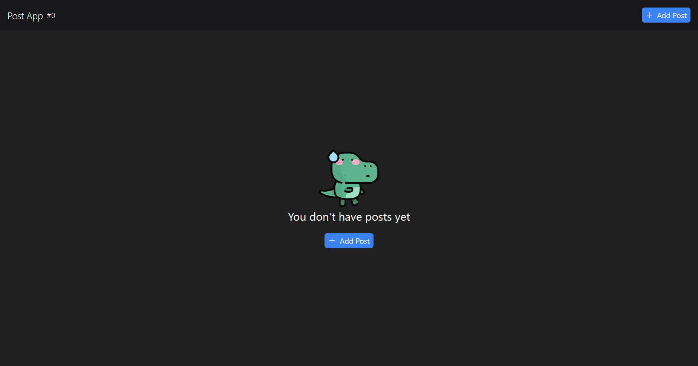
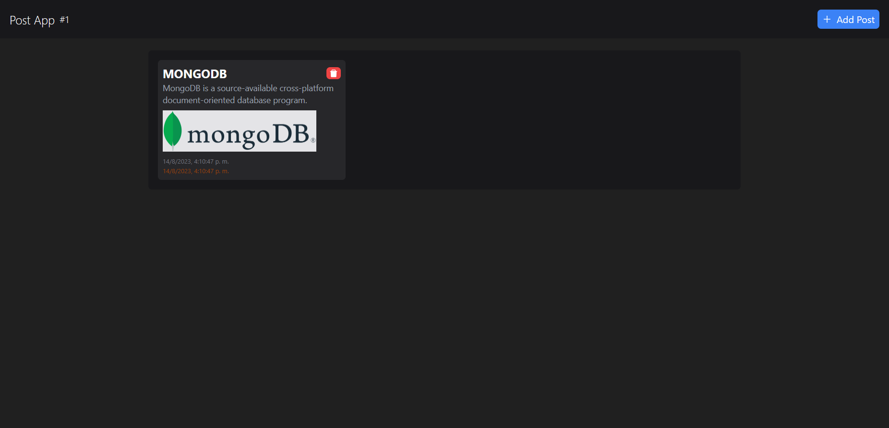

# MERN CRUD con Vite y Cloudinary (Aplicación FullStack)

Este proyecto es una aplicación web que utiliza el stack MERN (MongoDB, Express, React y Node.js) para crear un CRUD (Create, Read, Update, Delete) de Posts. En los posts se puede o no subir una imagen, la cual se guarda en Cloudinary.

## Screenshots




## Requisitos

Para ejecutar esta aplicación necesitarás tener instalado Node.js y MongoDB en tu equipo.

## Instalación

1. Clona este repositorio en tu equipo local.
2. Abre una terminal y navega hasta la carpeta del proyecto.
3. Ejecuta `npm install` para instalar las dependencias.
4. Navega hasta la carpeta client `cd client` y ejecuta `npm install` para instalar las dependencias del frontend.
5. Crea un archivo `.env` en la raíz del proyecto y agrega las variables de entorno necesarias para conectarte a tu base de datos MongoDB y a tu cuenta de Cloudinary.

```bash
npm run dev
# or
yarn dev
# or
pnpm dev
```

## Ejecución

1. Abre una terminal y navega hasta la carpeta del proyecto.
2. Ejecuta `npm run dev` para iniciar el servidor de desarrollo del backend.
3. Abre otra terminal, navega hasta la carpeta client y ejecuta `npm run dev` para iniciar el servidor de desarrollo del frontend.
4. Abre tu navegador web y navega hasta `http://localhost:3000` para ver la aplicación en funcionamiento.

## Tecnologías utilizadas

- MongoDB: base de datos NoSQL para almacenar los datos de los posts.
- Express: framework de Node.js para crear el servidor del backend.
- React: librería de JavaScript para crear la interfaz de usuario del frontend.
- Node.js: entorno de ejecución de JavaScript para el backend.
- Vite: herramienta de construcción para el frontend que permite un rápido desarrollo y construcción.
- Cloudinary: servicio en la nube para almacenar y servir imágenes.

**Client:** React, vite, TailwindCSS, Axios, toastify

**Server:** Node, Express, MongoDB, Cloudinary

Abre [http://localhost:3000](http://localhost:3000) con tu navegador para ver el resultado de la API.

Abre [http://localhost:5173](http://localhost:5173) con tu navegador para ver el resultado de la Aplicación.

## Aprende más

Para aprender más sobre Next.js, echa un vistazo a los siguientes recursos:

- [Documentación de Vite](https://vitejs.dev/guide/) - aprende sobre las características de Vitejs.

## Authors

- [@lace04](https://www.github.com/lace04)
